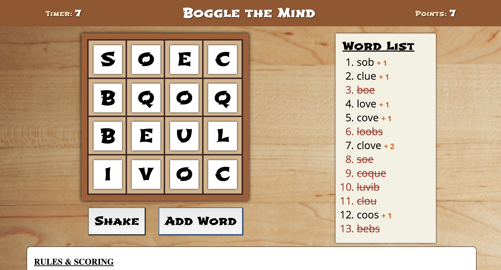

# Project: *Boggle the Mind*

<strong>Goal</strong>: Recreate a web version of the popular game [Boggle](https://en.wikipedia.org/wiki/Boggle). Make it a 4 x 4 grid with each consonant repeated 3 times and each vowel repeated 6 times plus a random choice of three more vowels added, totaling 96 choices (i.e. 16 dice * 6 sides).  Choose the letters with a random choosing function.  Add a 3-minute timer.

[View Work-in-progress on CodePen](https://codepen.io/SixStringsCoder/pen/PVdbpZ)

Screenshot

### Credits:
- [Background from here unsplash.com](https://images.unsplash.com/photo-1521710927254-3dd9ef96a3fa?ixlib=rb-1.2.1&q=85&fm=jpg&crop=entropy&cs=srgb&ixid=eyJhcHBfaWQiOjE0NTg5fQ)

### Extra features:
- Create a sand timer
- Allow for 5 x 5 or 6 x 6 grids
